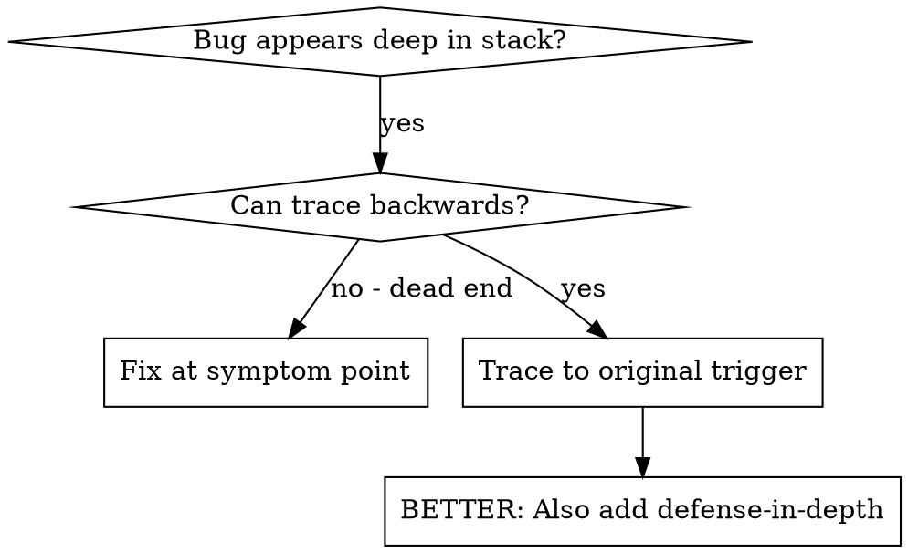
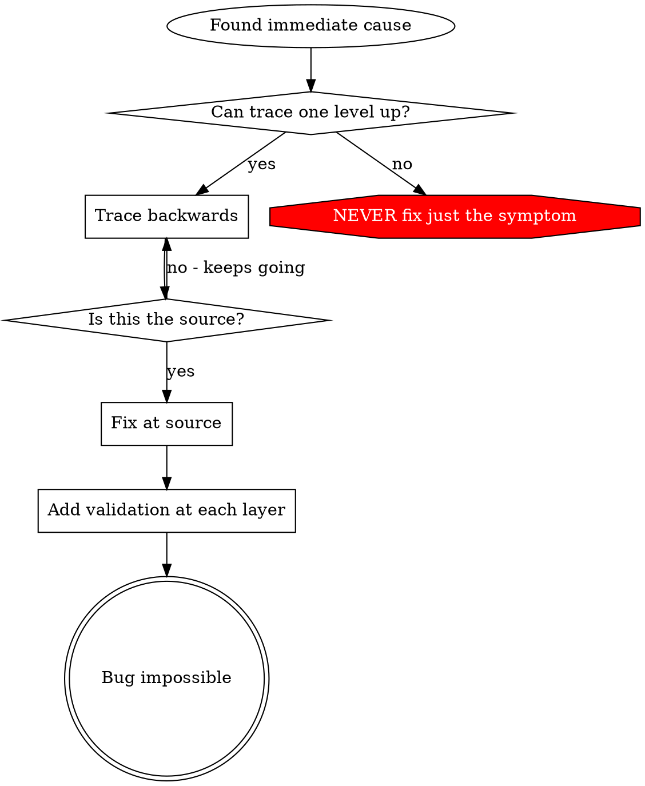

# Root Cause Tracing

## Overview

Bugs often manifest deep in the call stack (git init in wrong directory, file created in wrong location, database opened with wrong path). Your instinct is to fix where the error appears, but that's treating a symptom.

**Core principle:** Trace backward through the call chain until you find the original trigger, then fix at the source.

## When to Use



**Use when:**

- Error happens deep in execution (not at entry point)
- Stack trace shows long call chain
- Unclear where invalid data originated
- Need to find which test/code triggers the problem

## The Tracing Process

### 1. Observe the Symptom

```
Error: git init failed in /Users/jesse/project/packages/core
```

### 2. Find Immediate Cause

**What code directly causes this?**

```typescript
await execFileAsync("git", ["init"], { cwd: projectDir });
```

### 3. Ask: What Called This?

```typescript
WorktreeManager.createSessionWorktree(projectDir, sessionId)
  → called by Session.initializeWorkspace()
  → called by Session.create()
  → called by test at Project.create()
```

### 4. Keep Tracing Up

**What value was passed?**

- `projectDir = ''` (empty string!)
- Empty string as `cwd` resolves to `process.cwd()`
- That's the source code directory!

### 5. Find Original Trigger

**Where did empty string come from?**

```typescript
const context = setupCoreTest(); // Returns { tempDir: '' }
Project.create("name", context.tempDir); // Accessed before beforeEach!
```

## Adding Stack Traces

When you can't trace manually, add instrumentation:

```javascript
// JavaScript - before the problematic operation
console.error("DEBUG git init:", { directory, cwd: process.cwd(), stack: new Error().stack });
```

```php
// PHP - before the problematic operation
Log::debug("DEBUG git init:", ['directory' => $directory, 'cwd' => getcwd(), 'trace' => debug_backtrace()]);
```

```python
# Python - before the problematic operation
import traceback
print(f"DEBUG git init: dir={directory}, cwd={os.getcwd()}", file=sys.stderr)
traceback.print_stack()
```

**Critical:** Use stderr in tests (stdout/logger may be suppressed)

**Run and capture:**

```bash
# Adapt to your test runner
npm test 2>&1 | grep 'DEBUG git init'
php artisan test 2>&1 | grep 'DEBUG git init'
pytest 2>&1 | grep 'DEBUG git init'
```

**Analyze stack traces:**

- Look for test file names
- Find the line number triggering the call
- Identify the pattern (same test? same parameter?)

## Finding Which Test Causes Pollution

If something appears during tests but you don't know which test:

Use the bisection script `find-polluter.sh` in this directory:

```bash
./find-polluter.sh '<test_cmd>' '<pollution_check>' '<test_pattern>'

# Examples:
./find-polluter.sh 'npm test' '.git' 'src/**/*.test.ts'
./find-polluter.sh 'php artisan test' '.git' 'tests/**/*Test.php'
./find-polluter.sh 'pytest' 'tmp/' 'tests/**/test_*.py'
```

Runs tests one-by-one, stops at first polluter.

## Real Example: Empty projectDir

**Symptom:** `.git` created in `packages/core/` (source code)

**Trace chain:**

1. `git init` runs in `process.cwd()` ← empty cwd parameter
2. WorktreeManager called with empty projectDir
3. Session.create() passed empty string
4. Test accessed `context.tempDir` before beforeEach
5. setupCoreTest() returns `{ tempDir: '' }` initially

**Root cause:** Top-level variable initialization accessing empty value

**Fix:** Made tempDir a getter that throws if accessed before beforeEach

**Also added defense-in-depth:**

- Layer 1: Project.create() validates directory
- Layer 2: WorkspaceManager validates not empty
- Layer 3: NODE_ENV guard refuses git init outside tmpdir
- Layer 4: Stack trace logging before git init

## Key Principle



**NEVER fix just where the error appears.** Trace back to find the original trigger.

## Stack Trace Tips

**In tests:** Use stderr, not logger - logger output may be suppressed
**Before operation:** Log before the dangerous operation, not after it fails
**Include context:** Directory, cwd, environment variables, timestamps
**Capture stack:** Use your language's stack trace mechanism (JS: `new Error().stack`, PHP: `debug_backtrace()`, Python: `traceback.print_stack()`)

## Real-World Impact

From debugging session (2025-10-03):

- Found root cause through 5-level trace
- Fixed at source (getter validation)
- Added 4 layers of defense
- 1847 tests passed, zero pollution
